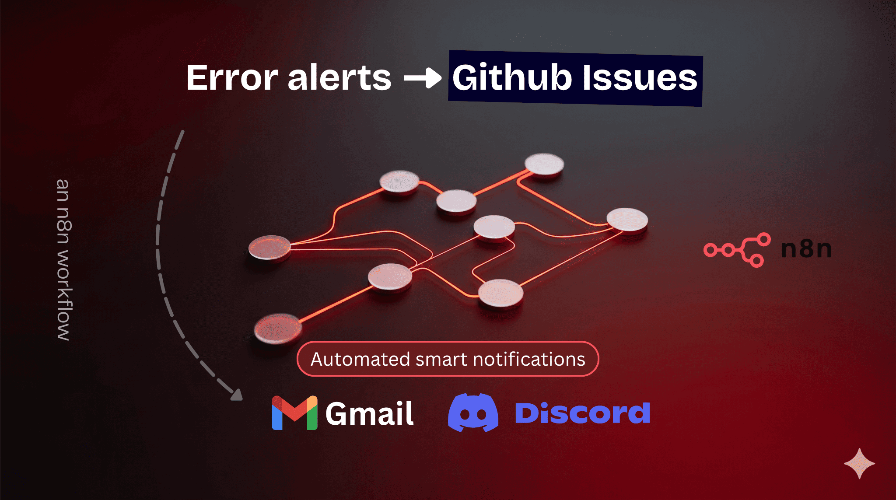
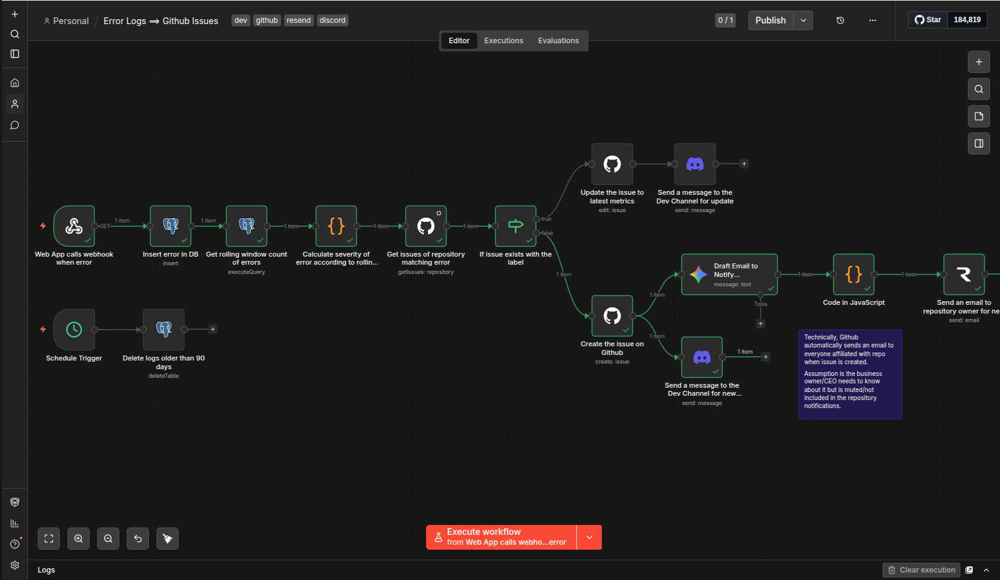

# N8N - Error Traige to Github Issues

This repository has the n8n workflow concerned with error triage where an app running into an error calls this endpoint and it triages it into an automated dev channel notification, with an issue being created on Github repository.

## Screenshots

### Hero

<p align="center">
  
</p>

### Workflow in n8n

<p align="center">
  
</p>

### Discord proof

This shows the agent sending messages in Discord.

<p align="center">
  
</p>

### Email notification

This shows the email sent to notify about the error triage.

<p align="center">
  
</p>

### GitHub issues created

This shows the issues created in GitHub Issues.

<p align="center">
  
</p>

### Individual issue view

This shows how a single issue looks on the inside.

<p align="center">
  
</p>

## Error Logs ==> Github Issue

The main idea is that a web application will call this endpoint with the `error data` whenever a `critical 500 error` is encountered in the application.

#### Endpoint Call Body ( POST Request )

```json
{
    "status": <status_code>,
    "error": <string>,
    "message": <string>,

    "userId": <user_uuid>,
    "location": <app_url_location>,
    "app_version": <build_version>
}
```

What the automation will do is that it will separate the errors based on the location. The priority level will be based on how many errors are being encountered in a 24 hour rolling window frequency.

The locations not having an error will of course not push a issue or invoke this endpoint.

**Case 1**
Rolling window frequency says

- Users encountered `77` errors while on the `/dashboard/project/new` location.
- Users encountered `11` errors while on the `/dashboard/post/new` location.

**Case 2**
Rolling window frequency says

- Users encountered `77` errors while on the `/dashboard/project/new` location but total errors over a month time period are 84. This means that something went wrong very recently.
- Users encountered `11` errors while on the `/dashboard/post/new` location but total errors over a month time period 58. This means that things were wrong previously but there are some edge cases left.

Issues will be identified by `Error ${<status_code>} : {<app_version>_<location>}`

## How this workflow works

1. The application calls the workflow endpoint.
2. The workflow gets the issues by the identification rule.
3. If the issue already exists, we increase it's severity level (how to? TBD)
4. If it does not, we create the issue.
5. Send an email (drafted by AI with the given inputs, also if the issue is assigned to anyone or not, like all the details of the issue) to adanayaztracer@gmail.com to notify about the issue's current status.

## Logs Storage

For storing the logs to calculate the rolling window frequencies, we will use the SQLite DB as a demonstration.
